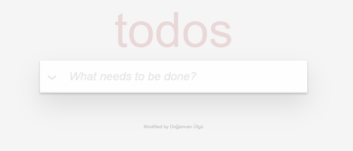
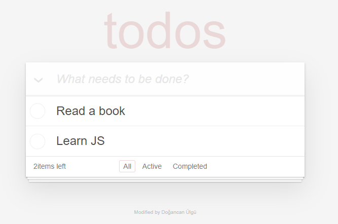
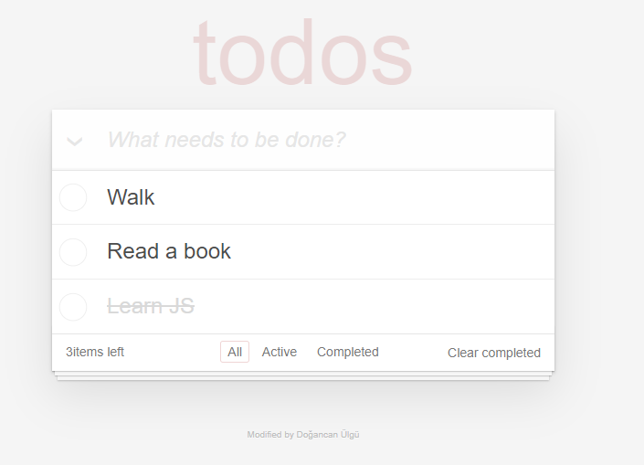
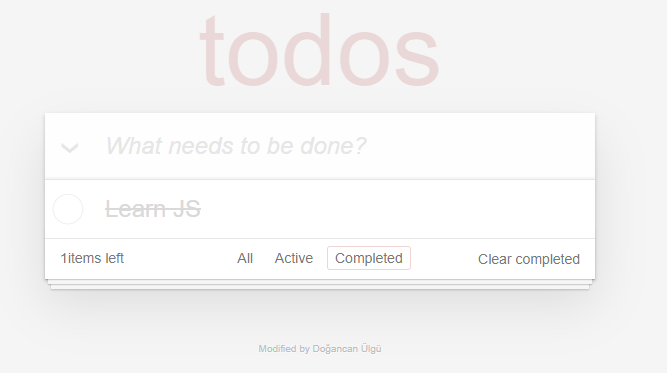
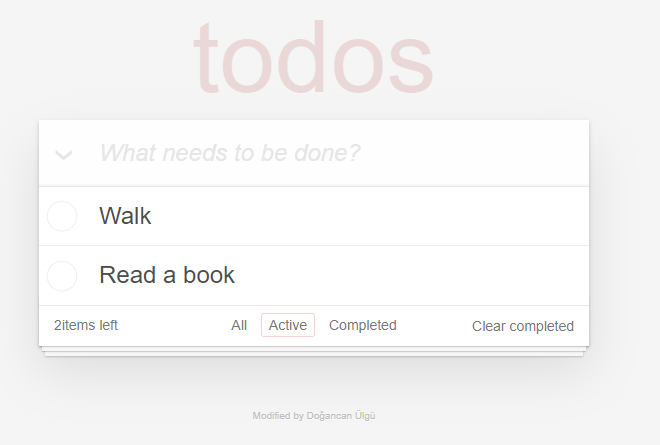
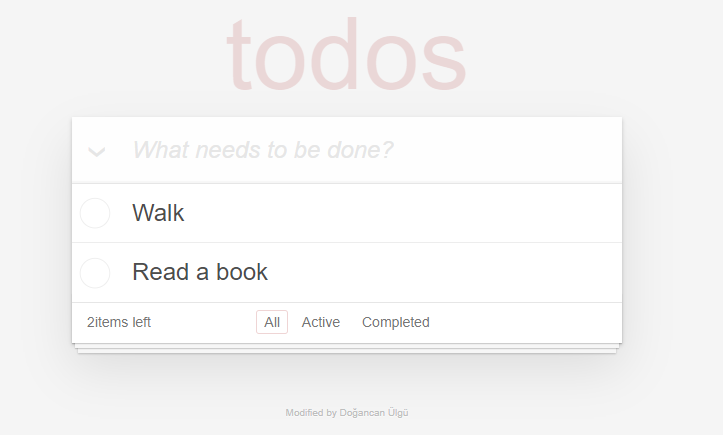

# Todo React App

Live: [Todo React App](https://todomvc-react-app.netlify.app/)

## Available Scripts

In the project directory, you can run:

```
npm start
```

Runs the app in the development mode.\
Open [http://localhost:3000](http://localhost:3000) to view it in the browser.

## Availability

- Add Todo
- Delete Todo
- Filter All, Active, Completed Todo
- Count Filtered Todo
- Auto Delete Completed Todo

## Home



## Add Todo



## Add and Complete Todo



## Filter Completed Todo



## Filter Active Todo



## Auto Delete Completed Todo


